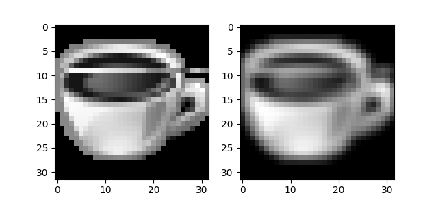

### Theoretical - Image Kernels

An **image kernel** is a small matrix used to apply effects such as blurring, sharpening, and edge detection. They are like ancestors of modern image processing techniques and even used today in machine learning for _feature extraction_, a technique for determining the most important portions of an image.

Below matrix is a 3x3 Gaussian Blur Kernel. For each pixel in the image, we take 3x3 block of neighbor pixels and multiply each pixel by the corresponding entry of the kernel and then take the sum. That sum becomes a new value of the pixel.

<table align = center>
    <tr>
        <td align = center>0.0625</td>
        <td align = center>0.125</td>
        <td align = center>0.0625</td>
    </tr>
    <tr>
        <td align = center>0.125</td>
        <td align = center>0.25</td>
        <td align = center>0.125</td>
    </tr>
    <tr>
        <td align = center>0.0625</td>
        <td align = center>0.125</td>
        <td align = center>0.0625</td>
    </tr>
</table>

If you want to learn more about image kernels, you can check *[wikipedia](https://bit.ly/2yfaapD)* page and _[this documentation](https://docs.gimp.org/en/gimp-filter-convolution-matrix.html)_ from gimp, also I certainly suggest you to look at _[this website](http://setosa.io/ev/image-kernels/)_ for visually explanation of image kernels.

### Practical - Image Kernels

Write a function that can apply the entered kernel to an image. You can use image *[here](materials/image-kernels/)*.

Example:
```
input   : (image in a matrix form), [[0, -1, 0], [-1, 5, -1], [0, -1, 0]]
output  : (filtered image in a matrix form)
```

I will use Python for this solution. Before coding, we need to import _[numpy](https://docs.scipy.org/doc/numpy/user/whatisnumpy.html)_ and _[matplotlib](https://matplotlib.org/)_ modules to our program. Numpy enables us to perform fast operations on matrices. Of course we can write our program without using numpy but it would be much harder. Matplotlib actually a plotting library for python but we need it just for showing our filtered image.

The hardest part of this process on edges of the image. Because we need to apply 3x3 matrix multiplication to every pixel with its neighbors, for edge pixels this requires values from pixels outside of the image boundaries. There are a variety of methods for handling image edges such as mirroring or cropping. In this example, for simplicity we will add a 1 pixel black border while processing, then remove it.

Firstly, we convert the type of input matrices from list of lists to n dimensional numpy arrays. Then we create 1 pixel larger matrix and fill the image values to that. After that, we grab every pixel with its neighbors and multiply with the values in kernel, then write the sum of the results to filtered matrix. And finally, we show the result image using matplotlib.

```python
import numpy as np
import matplotlib.pyplot as plt

def filter(image, kernel):
    image = np.array(image) # Convert to numpy array
    kernel = np.matrix(kernel) # Convert to numpy matrix

    height = len(image)
    width = len(image[0])

    # Create an empty matrix for processing
    processing_matrix = np.zeros([height + 2, width + 2], dtype=int) # 1 pixel larger from borders
    result = np.zeros([height, width]) # Create an empty matrix for output

    for row in range(len(image)): # For every row
        for col in range(len(image[row])): # For every element in a row
            # Copy element in image to 1 right, 1 down index in processing matrix for edge handling
            processing_matrix.itemset((row + 1, col + 1), image[row][col])

    for row in range(1, height + 1):
        for col in range(1, width + 1):
            neighbors = processing_matrix[row-1:row+2, col-1:col+2]

            # Sum of element-wise multiply
            total_value = 0.0
            for w in range(3):
                for h in range(3):
                    total_value += neighbors.item(w, h) * kernel.item(w, h)

            result.itemset(row-1, col-1, total_value) # Set final value to index

    plt.imshow(result, cmap="gray") # Show filtered image
    plt.show()
```

**Result:**

<p align="center"></p>

_Full code is [here](materials/image-kernels/demo.py)._