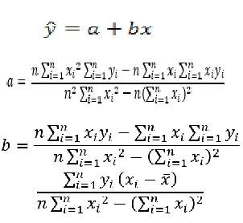
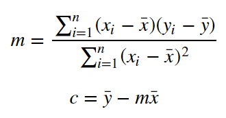
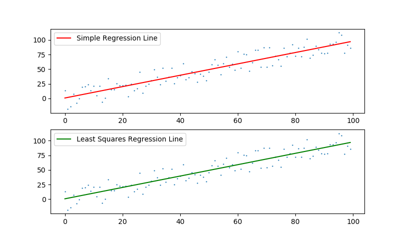

### Theoretical - Linear Regression

In statistical modeling, **[regression](https://en.wikipedia.org/wiki/Regression_analysis)** is a set of statistical processes for estimating the relationships among one dependent and one or more independent variables. **[Linear Regression](https://en.wikipedia.org/wiki/Linear_regression)** was the first type of regression analysis to be studied and to be used extensively in practical applications.

**[Least Squares](https://en.wikipedia.org/wiki/Least_squares)** is a linear regression method for estimating unknown parameters. The aim of the method is to minimize the difference between the observed responses and the responses predicted by the linear approximation of the data.

For more information, you can check these [1](https://youtu.be/KsVBBJRb9TE) - [2](https://youtu.be/coQAAN4eY5s) videos.

### Practical - Linear Regression

Write a function which returns the best fitting line for given data points.

We will use two different regression methods and write separate functions for both of them.

|Simple Linear Regression|Least Squares Regression|
|:---:|:---:|
|||

First, we generate points of ```y = x``` line with random error. Then, we will try to estimate this line using two different methods. Finally, we plot two lines respectively.  

```python
import random
import numpy as np
import matplotlib.pyplot as plt

# Generating the data
n = 100
err = 20
x = list(range(n)) # [0,1,...,99]
# y = a*x + b (a = 1 and b values change between - error and + error
y = [i + random.random() * 2 * err - err for i in x]

# Simple Linear Regression
def simple_regression(x, y):
    m = (np.sum(x[i]*y[i] for i in range(n)) - (1 / n) * np.sum(x) * np.sum(y)) / (np.sum(i*i for i in x) - (1 / n) * (np.sum(x) ** 2))
    c = np.mean(y) - m * np.mean(x)
    line = [m * i + c for i in x]
    return line

# Least Squares Regression
def least_squares_regression(x, y):
    m = np.sum((x[i] - np.mean(x)) * (y[i] - np.mean(y)) for i in range(n)) / np.sum((x[i] - np.mean(x)) ** 2 for i in range(n))
    c = np.mean(y) - m * np.mean(x)
    line = [m * i  + c for i in x]
    return line

simple_regression_line = simple_regression(x, y)
least_squares_regression_line = least_squares_regression(x, y)

fig, ax = plt.subplots(nrows=2, ncols=1) # 2 Subplots

ax[0].scatter(x, y) # Data Points
ax[0].plot(x, simple_regression_line, "r-") # Estimated Line
ax[0].legend(["Simple Regression Line"])

ax[1].scatter(x, y) # Data Points
ax[1].plot(x, least_squares_regression_line, "g-") # Estimated Line
ax[1].legend(["Least Squares Regression Line"])

plt.show()
```

The result should be like this. Code can be accessed from [here](materials/linear-regression/regression.py).

<p align="center">
  
</p>
