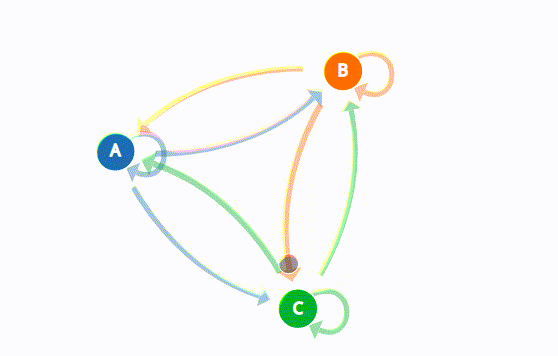

### Theoretical - Markov Chains

A Markov Chain is a sequence of states. The idea of a sequence means, there should always be a transition where the state goes from one state to another.

For example, You could think of the behaviors of a baby as a Markov Chain Model, you might include **playing, eating, sleeping, and crying** as states, which together creates a **state space**, a list of all possible states. A typical sequence can be like (play --> eat --> sleep --> cry). A Markov Chain tells you the probability of transition from one state to any other state.

<p align="center">
  
</p>

Marcov Chains used in a variety of fields to analyze a sequence of states and also generate or predict outcomes based on that sequence such as financial data, scientific data, weather patterns, or predicting an earthquake based on sensor readings. You can look [this great visual explanation](http://setosa.io/ev/markov-chains/) of Marcov Chains.  

We can generate a sequence of states based on existing states and probability of outcomes after that.
And also we can think of text as a sequence of states. Every character represents a state. Or we could also think text as a sequence of states on word level.

As a result, we can adjust probabilities of states (words or characters) based of an existing source text.
Besides each state can be a single word or character, also there is a concept known as **_n-gram._** n-gram is a contiguous sequence of n states from a given sequence. n-gram models widely used in Communication Theory and Natural Language Processing. You can check Google's [n-gram Viewer](https://books.google.com/ngrams) and see the frequency of every word or sequence of words. Also [here is a awesome visualization](http://www.chrisharrison.net/index.php/Visualizations/WebTrigrams) of Tri-Grams.

[Here](https://youtu.be/eGFJ8vugIWA) is a video on generating text using character level n-grams in JavaScript.


### Practical - Markov Chains

Write a program which generates text using n-grams from input text.

In order to generate text, first we need to create a state space for given source text. ```addWords()``` function will add every different word to a dictionary as a key, and assign an empty list as value. Then we will add every word to the previous word's associated list. **(Createing bi-grams)** After that, we should have a list of next possible words for each word in source text. Same word can be found more than one in list. This means the probability of that word is higher.

Finally, we will specify the initial word for text to start generating. And program will automatically start to generate a sequence of words _(randomly selecting a word from the previous word's corresponding list)_ via for loop. 

```python
import random

text = open("file.txt").read().split() # Read Source Text
wordsDict = dict()

def addWords(text): # Add every different word to the dictionary
    for word in text:
        if text.index(word) == (len(text) - 1):
            break
		if not word in wordsDict:
			wordsDict[word] = list()

def addToPossibilities(word, nextWord): # Add next words to each list
	wordsDict[word].append(nextWord)

def findIndex(word, indexNum): # Find the index of word in source text
	indexes =  [i for i, e in enumerate(text) if e == word] # Indexes of all occurence
	return indexes[indexNum]

def learn(text):
	addWords(text)
	for word in text:
		if text.index(word) == (len(text) - 1): # Don't check last word
			break
		indexNum = len(wordsDict[word]) # Next words of previous occurrence
		addToPossibilities(word, text[findIndex(word, indexNum) + 1])

def run(n, initialWordIndex):
    currentWord = text[initialWordIndex] # First word
    for i in range(n): # print next n words
        print(currentWord, end = " ")
        nextWord = random.choice(wordsDict[currentWord]) # Select random word next word from list
        currentWord = nextWord

# Generate text with 100 words
learn(text)
run(100, 0)
```

You can find the working example code from [here](materials/markov-chains/demo.py).