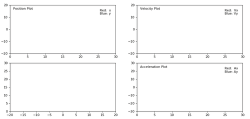

### Theoretical - Mass Spring Damper Simulation

Mass-Spring-Damper System would be the most common and most important example as the same time in differential equation. Especially you are studying mechanical or control engineering, you would be very familiar with this kind of model.

_The sum of the forces acting on a body equal its mass times it’s acceleration. - Newtons 2nd Law_

The **mass** of the dynamic system is lumped into a single point mass in the system. The inertial effect of the dynamic system is related through this lumped mass.

The stored energy of the dynamic system is modelled as a one-dimensional **spring** in the system. The spring is able to store energy inside when it is stretched or compressed from its original length.

The consumed energy of the dynamic system is modelled through a one-dimensional **damper** in the system. You can think that it is able to waste energy as heat in the dynamic system.

<p align="center">
  
</p>

These three components, **mass, spring and damper** can model any dynamic response situation in a general sense. Mathematically the linear dynamic equation is represented below.

<p align="center">
  
</p>

Where, **F** is the external force applied to the dynamic system. **m, b, and k** denotes the mass, damping coefficient, and spring coefficient. **x, x', and x''** denotes the displacement, velocity and acceleration vectors respectively.

For more information, you can check [this website](http://www.sharetechnote.com/html/DE_Modeling_Example_SpringMass.html) and [this presentation](www.sharetechnote.com/html/DE_Modeling_Example_SpringMass.html) from Prof. R.G. Longoria, University of Texas.

### Practical - Mass Spring Damper Simulation

Create a physics simulation of a Mass-Spring-Damper System and plot the displacement, velocity and acceleration changes.

For simplicity, we will use pre-written Python visualizer code *[here](materials/mass-spring-damper-simulation)*. It uses _[matplotlib](https://matplotlib.org/)_ package to plot In order to simulate displacement, velocity and acceleration quantities. In order to this first we need to save visualizer.py file and import that to our python code.

Visualizer object takes a **callback function** which is basically returns new 2D position value each time it is called, a **time interval** which represents sampling period for this continuous system in milliseconds, **simulation_time** for plotting range, and **initial position** of the mass in 2D cartesian coordinate system. Although this Visualizer prepared for plotting 2D simulations, our system will move in only 1D, so we'll change x values only and make y values constant.

All we need to do is implementing **Force = mass * acceleration + b * velocity + k * position** equation. In this system lets assume external force is zero and initial position is 15.

<p align="center">
  
</p>

Also we know that in order to compute position we need to take integral of acceleration two times. Because computers can't calculate real integral, we should use [limit definition of the integral](https://www.khanacademy.org/math/ap-calculus-ab/ab-integration-new/ab-6-3/a/definite-integral-as-the-limit-of-a-riemann-sum) to approximate an integral like above.

Mass will will move from initial point (x = 15) to the center (x = 0) and oscillate. It will lose its energy in time and stop at the center after a while.


```python
from visualizer import Visualizer # Import Visualizer class

dt = 0.05 # ΔT (sampling period) seconds

# Initial values
position = 15
velocity = 0
acceleration = 0

# Constants
mass = 1 # mass
k = 2.5 # spring coefficient
b = 0.3 # damping coefficient

# Callback Function
def set(arg):
    global dt, position, velocity, acceleration, mass, k, b # Get global variables

    spring_force = k * position # Fs = k * x
    damper_force = b * velocity # Fb = b * x'

    # If we leave the acceleration alone in equation
    # acceleration = - ((b * velocity) + (k * position)) / mass
    acceleration = - (spring_force + damper_force) / mass
    velocity += (acceleration * dt) # Integral(a) = v
    position += (velocity * dt) # Integral(v) = x

    return (position, 0) # Return position

# Start simulation
Visualizer(callback=set, interval=dt * 1000, simulation_time=30, initial=(position, 0, velocity, 0, acceleration, 0))
```

The result should be like this. You can find the full code from [here](materials/mass-spring-damper-simulation/demo.py).

<p align="center">
  
</p>

_Thanks to **[@senceryazici](https://github.com/senceryazici)** for his *[Visualizer](materials/mass-spring-damper-simulation/visualizer.py)* module._
