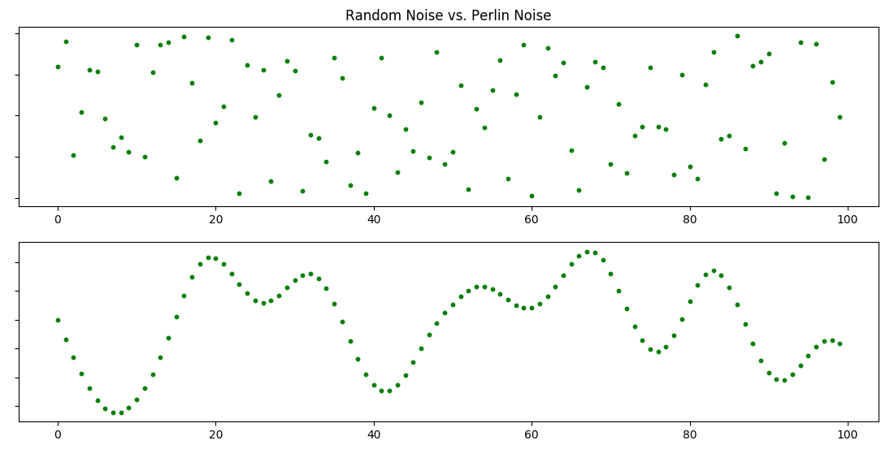
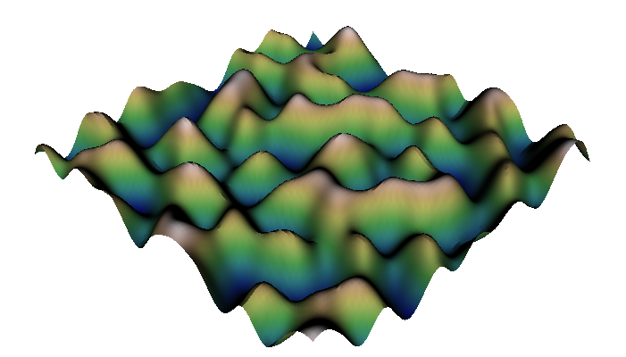

### Theoretical - Perlin Noise

[Perlin noise](https://en.wikipedia.org/wiki/Perlin_noise) is a random sequence generator producing a more natural, harmonic succession of numbers than that of the standard ```random()``` function. It was developed by Ken Perlin in the 1980s and has been used in graphical applications to generate procedural textures, shapes, terrains, and other seemingly organic forms.

Difference between random numbers and perlin noise shown below.
<p align="center">
  
</p>

Ken Perlin developed this algorithm for Disney's computer animated sci-fi motion picture [Tron (1982)](https://www.imdb.com/title/tt0084827/). In 1997, he won an Academy Award for Technical Achievement from the Academy of Motion Picture Arts and Sciences for this contribution to CGI.

If you want to learn how this algorithm works, please check out this [Khan Academy lecture](https://www.khanacademy.org/computing/computer-programming/programming-natural-simulations/programming-noise/a/perlin-noise). For more deeply information you can look [here](http://web.archive.org/web/20160530124230/http://freespace.virgin.net/hugo.elias/models/m_perlin.htm).

[Simplex Noise](https://en.wikipedia.org/wiki/Simplex_noise) is an improvement on "classic" perlin noise by Ken Perlin himself. This algorithm has fewer directional artifacts and used in higher dimensions with lower computational overhead.

For more information about this topic, you can look links below.
- [Understanding Perlin Noise](http://flafla2.github.io/2014/08/09/perlinnoise.html)
- [Improving Noise](https://mrl.nyu.edu/~perlin/paper445.pdf)
- [Noise Hardware](https://www.csee.umbc.edu/~olano/s2002c36/ch02.pdf)
- [Working with Simplex Noise](https://cmaher.github.io/posts/working-with-simplex-noise/)
- [Simplex Noise Demystified](http://staffwww.itn.liu.se/~stegu/simplexnoise/simplexnoise.pdf)

### Practical - Perlin Noise

Write a program and show Simplex Noise in 1D

[Here](https://gist.github.com/eevee/26f547457522755cb1fb8739d0ea89a1) is a Python implementation of Perlin Noise. You can examine that but for simplicity I will use [OpenSimplex](https://pypi.org/project/opensimplex/) package. Using this package, we can generate 2D, 3D and 4D simplex noise in Python.

Before starting, we import opensimplex module for noise values and matplotlib for plotting the result. First, we create a OpenSimplex object. Then using numpy's ```linspace()``` function, we generate our noise values. We will create 1D noise so we just need to get one of the values of 2D noise. ```noise2d()``` function returns values between -1 and 1. Finally, we plot x values and the data values respectively using matplotlib.

```python
from opensimplex import OpenSimplex
import numpy as np
import matplotlib.pyplot as plt

noise = OpenSimplex()
n = 100 # Number of values
x = [i for i in range(n)] # List of numbers from 0 to 99

y = []
for i in np.linspace(0, 10, n): # Create 100 point from 0 to 10
    y.append(noise.noise2d(i, 0))

plt.xlim((0, n))
plt.ylim((-1, 1))
plt.scatter(x, y)
plt.plot(x, y, 'r')
plt.show()
```

---

Write a program and show Simplex Noise in 3D

We can generate terrains using simplex noise. For this application, I will use [mayavi](https://docs.enthought.com/mayavi/mayavi/) instead of matplotlib. Because 3D plotting in mayavi is much more efficient. In order to get smooth values, we must take small steps on the ```noise2d()``` function. Because of this, I simply divide 10. Also due to this function gives values between -1 and 1, I will map it between 0 and 10 via adding 1 and multiplying with 10.

```python
from opensimplex import OpenSimplex
import numpy as np
from mayavi import mlab

def generate_terrain(n):
    noise = OpenSimplex()
    z = [[0 for x in range(n)] for y in range(n)] # Create empty 2D matrix
    for i in range(n):
        for j in range(n):
            z[i][j] = (noise.noise2d(((i + 1) / 10), ((j + 1) / 10)) + 1) * 10 # Add noise value
    return z

z = generate_terrain(100) # 100*100 terrain
mlab.surf(z) # Surface Plot
mlab.show()
```

The result should be like this. You can find the full code from [here](materials/perlin-noise/opensimplex-demo.py).

<p align="center">
  
</p>


You can use higher dimensional noise functions to make organic looking visuals. [Here](https://necessarydisorder.wordpress.com/2017/11/15/drawing-from-noise-and-then-making-animated-loopy-gifs-from-there/) is and example of using perlin noise to make animated loop GIFs.
